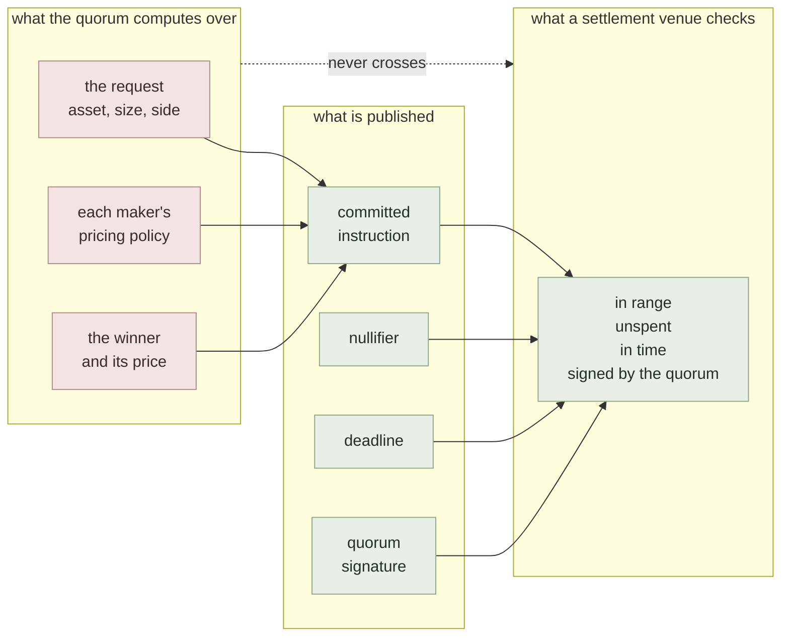
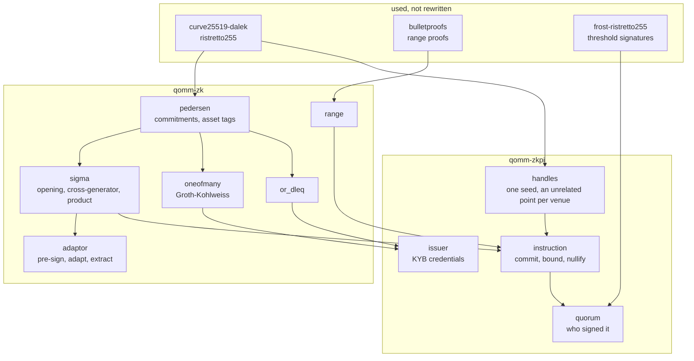

# zkpi

**zkPI** is a *zero-knowledge payment instruction*.

Proof-carrying instructions: a venue's decision, provable without the inputs that produced it.


## What it does



## What it is made of



Generated from one shared research tree, which is why the layout is regular
across the three repositories. This repository is nevertheless self-contained:
its tests, locks, measurements and source do not require the private working
tree.

## What is here

Rust crates:

- `rust/qomm-zk`
- `rust/qomm-zkpi`
- `rust/qomm-proofs`
- `rust/qomm-measure`
- `rust/qomm-harness`

Measurement binaries carried by `qomm-harness`:

- `run_quote_proof`
- `run_state_audit`
- `run_voleith`
- `zk_bench`
- `zk_compare`

`artifacts/` holds the measurements the numbers in the paper are taken from, as
the binaries wrote them. Each carries the host it ran on as a label (`host-a`,
`host-b`, `host-c`) rather than a machine name; the private mapping back
to real machines is not published.

## Documents

- [`POSITION.md`](POSITION.md) --- what is new here and what is not, stated line by line against the nearest prior work
- [`ACCOUNTABILITY.md`](ACCOUNTABILITY.md) --- what happens when a node misbehaves: the five rungs from abort to guaranteed output delivery, and which one each mechanism here reaches
- [`ZKPI_WIRE.md`](ZKPI_WIRE.md) --- the bytes an instruction travels as, the vectors to check an implementation against, and where it can run
- [`REVIEW.md`](REVIEW.md) --- what two rounds of review found, including what was checked and found sound
- [`doc/ja/DEFMI_ZKPI_USE_CASES.md`](doc/ja/DEFMI_ZKPI_USE_CASES.md) --- non-QOMM uses for proof-carrying instructions and decentralized settlement, with prior art and an implementation order

## Depends on

- [qomm](https://github.com/zkFMI/qomm)

Cargo resolves these repositories from the checked-in lock file.

## Enterprise PoC

[Enterprise PoC guide (Japanese)](docs/ENTERPRISE_POC_JA.md) explains the
installation, role separation, failure cases, evidence to retain and acceptance
criteria for a company-run evaluation.

## Running it

```sh
cd rust
cargo test -j 4 --locked --workspace
```

## Measurements

Every reported number has an artifact and a Rust binary that produces it. Where a
measurement needs something not shipped here --- MP-SPDZ, a second host, a market
data feed --- the binary says so and fails rather than substituting a default.

## License

MIT. See `LICENSE`.
