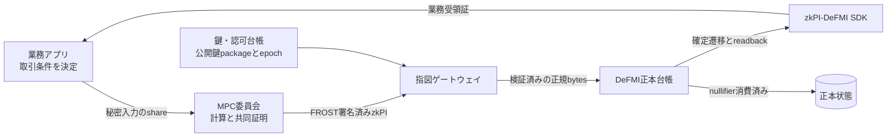

# zkPI 企業向けPoC導入ガイド

## このPoCで確認すること

zkPIは、取引や業務アプリケーションが決めた結果を、入力の秘密を必要以上に
公開せず、検証可能な一回限りの支払・受渡し指図として決済基盤へ渡すための形式である。

PoCでは次を確認する。

- 同じ指図が、発行側と検証側で同じバイト列になる。
- 指図が対象アプリケーション、対象決済先、期限、範囲証明、認可者集合へ結ばれる。
- 壊れた指図、期限切れ、不足署名、別用途への差替えを拒否する。
- nullifierにより同じ指図を二度使えない。
- 決済側は秘密入力ではなく、公開検証文と指図だけを受け取る。

zkPI単体は残高を持たず、資金移動も行わない。実際の一回限り消費と原子的決済は
DeFMIなどの決済先が正本状態として実装する必要がある。

## 推奨する担当者

| 担当 | PoCでの役割 |
|---|---|
| アプリケーション担当 | 何を計算し、どの公開結果を指図へ結ぶか定義する |
| MPC/ZK担当 | 証明結果、共同署名、公開文を生成する |
| 決済担当 | 指図検証、nullifier消費、資産移動を実装する |
| 鍵管理担当 | 認可者集合、公開鍵package、鍵更新、事故時停止を管理する |
| 監査担当 | 正規バイト列、拒否理由、再送、期限、版管理を確認する |

## 必要な環境

- インターネットへ公開しないLinux環境。
- Gitと、`Cargo.lock`を変更せず利用できるRust toolchain。リポジトリには
  `rust-toolchain.toml` がないため、PoC開始時に `rustc --version` を記録し、承認した版を
  全ビルド機で揃える。統合Docker buildが現在使う参照版はRust 1.97.1である。
- テスト用の使い捨て鍵。実運用鍵や実顧客データは使用しない。

## 1. ソースと基準試験を固定する

```sh
git clone https://github.com/zkFMI/zkpi.git
cd zkpi
git checkout <社内で承認したcommit>
git rev-parse HEAD

cd rust
cargo test -j 4 --locked --workspace
cargo build -j 4 --release --locked -p zkpi --bin zkpi-verify
```

依存lockが変わった場合は進めず、差分を審査する。

## 2. 指図の発行・符号化・検証を一周させる

`--self-test` は、テスト用の共同鍵で指図を発行し、符号化、復号、検証までを
一つのプロセスで行う。

```sh
./target/release/zkpi-verify --self-test
```

終了コード0と、`accepted --- issued, encoded, decoded and verified` が必要である。
これは配線確認であり、企業の鍵管理や外部決済との統合を証明するものではない。

## 3. 相互運用用テストベクトルを確認する

```sh
cd ..
mkdir -p poc-output/zkpi-vectors
rust/target/release/zkpi-verify --vectors poc-output/zkpi-vectors
rust/target/release/zkpi-verify --check-vectors poc-output/zkpi-vectors
rust/target/release/zkpi-verify --spec > poc-output/zkpi-wire-spec.md
```

受理用ベクトルは復号後に同じバイト列へ戻り、壊れた版、短すぎる入力、余分な末尾、
不正な点などの拒否用ベクトルはすべて拒否されなければならない。

別言語の実装を作る場合も、このRust実装とベクトルを基準にする。ただし、正規化、
署名文、証明検証、nullifierの基準実装を別言語へ移す場合は、同一バイト列と拒否集合を
必ず相互試験する。

## 4. 独立した検証プロセスとして使う

実運用に近い確認では、発行プロセスと検証プロセスを分ける。検証側は、FROSTの
公開鍵package、検証時刻、domainを明示し、指図を標準入力で受け取る。

```sh
cat poc-output/instruction.bin | \
  rust/target/release/zkpi-verify \
  --quorum <FROST公開鍵packageの16進表現> \
  --now <検証時刻のUnix秒> \
  --domain <承認したdomain>
```

`--quorum`と`--now`を省略した実行は、バイト列を解析するだけで証明を検証しない。
その成功を「zkPI受理」として記録してはいけない。

このCLI経路が確認するのは、既定の32ビット金額・32ビット価格、既定generatorを使った
証明、FROST署名、期限、domainである。CLIは `Venue::require_threshold_ranges()` を有効に
しないため、version 1の単独作成Bulletproofも受理し得る。また、配備ごとに変更した
`Bounds`を指定できない。したがってCLI単体を商品経路の最終gateにはしない。本番相当の
gatewayは、配備時の `Bounds` で `Venue` を作り、`require_threshold_ranges()` を呼んだ
library経路でversion 2のしきい値範囲証明だけを受理する。16ビット設定など既定値と異なる
ベクトルは、その同じlibrary設定で検証する。

公開鍵packageは単なる集約公開鍵ではなく、認可された署名者集合を含む。どの鍵集合を
どのdomain、アプリケーション、決済先で信頼するかを設定管理対象にする。ただし完成した
FROST署名が示すのは、そのpackageに属するいずれかのしきい値数の参加者が署名したことであり、
個々の署名者を外部検証者へ列挙するものではない。

## 5. 自社アプリケーションへ結ぶ

次の値を、自社アプリケーションの実行と同じ公開文から導出する。

- アプリケーションIDと版。
- 実行job ID、入力commitment、状態版。
- 許可する資産、数量、価格、期限の範囲。
- 決済先domainとvenue handle。
- 認可者集合と共同署名。
- 一回限りのnullifier。
- 必要な範囲証明と照合結果の要約値。

指図を作る前に、対象決済先へ予約を作成する。指図を受け取ってから任意の口座や資産を
追加指定できるAPIにすると、正しい計算結果を別の決済へ差し替えられるため禁止する。

## 6. 必須の拒否試験

- magic、版、長さ、末尾バイトの不正。
- 不正なcurve pointと壊れたproof。
- 別domain、別アプリケーション、別venueへの差替え。
- 期限直前、期限一致、期限後。
- 認可されていない署名者、不足署名、別の公開鍵package。
- 数量・価格範囲外と、範囲証明の入替え。
- 入力commitment、状態版、job IDの入替え。
- 同じnullifierの二回目提示。
- 正しい指図を別の予約や別のDeFMI状態根へ移す試み。

最後の二項目はzkPIライブラリだけでは正本状態を持たないため、DeFMIなどの決済先と
統合した試験で確認する。

## 7. 保存する証拠

- Git commit、Cargo.lockのSHA-256、Rust版。
- wire specificationと全テストベクトルのSHA-256。
- 公開鍵packageのfingerprint、domain、アプリケーションID、版。
- 指図のfingerprint、検証時刻、終了コード、受理・拒否理由。
- 発行側と検証側で一致した正規バイト列のSHA-256。
- nullifierの初回受理と二回目拒否を示す決済側受領証。
- 期限、鍵更新、旧鍵停止の試験結果。

秘密鍵、証明の秘密入力、顧客識別情報を証拠フォルダへ残さない。

## 8. PoC合格条件

- 自社アプリケーション結果とzkPIが同じ公開文へ束縛される。
- 独立検証プロセスが配備時の `Bounds` と `require_threshold_ranges()` を使い、商品policy上
  正しいversion 2指図だけを受理する。既定CLIだけの成功ではこの条件を満たさない。
- 受理用ベクトルの再符号化が完全一致する。
- 拒否用ベクトルと差替え試験がすべて失敗側へ閉じる。
- 決済側がnullifierを正本で一度だけ消費する。
- 期限、domain、鍵集合、状態版が設定として追跡できる。

## 本番移行前に別途必要なもの

- HSMまたは同等の鍵保護、共同鍵生成、署名者交代、緊急停止。
- domainとアプリケーション版の変更手続き。
- 外部暗号監査、fuzzing、相互運用試験、負荷試験。
- 時刻源、失効、監査ログ、バックアップ、インシデント対応。
- DeFMIなど正本台帳側の二重使用防止と原子的決済。

PoC用 `--self-test` の成功は、本番鍵や本番決済の安全性を保証しない。

## 9. 何が実装されていて、何を利用企業が用意するか

この `zkpi` リポジトリが提供するのは、決済指図のライブラリ、正規のバイト形式、独立検証用
CLIである。DeFMI接続用 `zkpi-defmi-sdk` は
[DeFMIリポジトリ](https://github.com/zkFMI/defmi) で配布され、`qomm-transport` と
`defmi` に依存する。銀行の勘定系や取引所へそのまま公開する完成済みAPIサーバーではない。
PoCでは、次の境界を最初に固定する。

| 部品 | このリポジトリで提供 | 導入企業が実装・設定 |
|---|---|---|
| 基本zkPI | commitment、範囲証明、FROST署名、検証 | 自社取引をどの指図へ写すか |
| 正規形式 | magic、版、項目順、長さ、拒否条件 | 保存形式、API上限、配信経路 |
| 検証CLI | 解析、既定Boundsでの証明・署名・期限・domain検証 | 商品用threshold-only gate、配備Bounds、常駐化、認証、流量制御、監視 |
| 型付き指図 | 予約、決済、受取債権、越境DvPの束縛 | 自社業務IDと型の対応 |
| アプリSDK | DeFMIリポジトリ側でQOMM/OCLOB manifest、7ノード実行束縛、確定受領証を提供 | MPC実行基盤、DeFMI RPC、業務DB |
| 二重使用防止 | nullifierの導出 | 正本台帳での原子的な照合・消費 |
| 鍵管理 | FROSTの型と検証 | DKG、保管、交代、失効、事故対応 |

`zkpi` は指図そのものを扱う。DeFMIリポジトリの `zkpi-defmi-sdk` は、
アプリケーションの定義、7ノードの実行記録、DeFMIの確定状態を一つの業務受領証へ結ぶ。
両者を同じ配布物と扱わない。

## 10. 暗号技術を平易に整理する

### 10.1 Pedersen commitment

金額、価格、資産、支払側、受取側をそのまま指図へ書かず、後で同じ値だったと確認できる
要約値へ変換する。commitmentだけから元の値を読むことは想定しない。

重要なのは、commitmentを作る際に使う乱数も秘密であることである。元の金額が小さい
候補集合しかなくても、乱数を知らなければ単純な総当たり照合を防げる。逆に、同じ乱数を
再利用すると指図間の関係が漏れ得るため、一つの値ごとに新しい乱数を使う。

### 10.2 範囲証明

金額や価格を公開せずに、あらかじめ決めたビット幅へ収まることを示す。現在の実装は、
移行互換用の単独作成Bulletproofと、MPCノードが共同で作るしきい値範囲証明を区別する。
商品経路では後者を要求する。

標準値は金額32ビット、価格32ビット、最大期限24時間である。ただし、これは全市場に
適した業務上限ではない。利用企業は対象資産の最小単位、最大発注量、最大価格、期限を
決め、オーバーフローしないことを別途確認する。

### 10.3 FROST共同署名

一つの完成署名を複数の認可者が共同で作る。検証側は一つの公開鍵packageで確認できる。
公開鍵packageには、集約公開鍵だけでなく構成員ごとの公開verification shareが含まれるため、
「承認した構成員集合から作ったpackageか」を設定として固定できる。一方、完成署名だけから
実際に署名へ参加した個々の構成員を特定することはできない。

FROSTの署名しきい値と、MPCの秘密復元しきい値は別である。QOMMの標準manifestは7ノード、
秘密復元に必要な結託数2、認可署名3としているが、これはSDKの現在の製品形状であり、
法務上の署名権限やAvalancheの合意条件と同じ意味ではない。

### 10.4 Ristretto255

commitment、匿名handle、FROSTにはRistretto255上の点を使う。バイト列を点へ戻せない場合、
正規でないscalar、壊れた署名は拒否する。入力バイト列を「だいたい読めた」として修復する
処理は入れない。

### 10.5 hashとdomain分離

同じ値が別用途で再利用されないよう、用途ごとに異なるdomain文字列をhashへ入れる。
例として、基本指図、nullifier、資産ID変換、法人handle、Aethel受取債権、越境DvPは異なる
domainを持つ。利用企業が設定するvenue domainも署名対象に含まれる。

### 10.6 nullifier

nonceと支払・受取handleから、一度だけ使える公開番号を導く。nullifierは秘密情報そのもの
ではないが、同じ値を二度受理してはいけない。二重使用を防ぐ最終責任は、複数要求が同時に
来ても一つだけ成功させる正本台帳にある。

## 11. 信頼境界とデータの見え方



各主体が見えるものを決めておく。

| 主体 | 見えてよい | 見せない |
|---|---|---|
| 業務アプリ | 自社入力、業務ID、最終結果 | 他社の入力、他社の秘密鍵 |
| 単一MPCノード | 自分のshare、公開文、実行順 | 完全な金額・価格・全秘密 |
| 指図ゲートウェイ | zkPI bytes、公開鍵epoch、受理結果 | commitment opening、法人実名対応 |
| DeFMI検証者 | 公開文、証明、nullifier、正本遷移 | MPCの秘密share、個別価格方針 |
| 監査者 | digest、版、署名者集合、受領証 | 秘密入力、鍵share、本人情報 |

「秘密」と「匿名」は同じではない。通信時刻、送信元、指図サイズ、失敗時だけ発生する通信は、
暗号化されていても問い合わせの存在を示し得る。必要なら固定周期、固定サイズ、dummy処理、
中継層を組み合わせる。

## 12. 推奨ハードウェア

ここで示す値はPoC開始時の構成例であり、保証性能ではない。実際の必要量は指図サイズ、
証明方式、同時処理数、保存期間、RTTにより測る。

### 12.1 最小機能確認

一台のLinux機でCLIとライブラリ試験を行う場合は次を出発点にする。

- x86_64またはAArch64の64ビットCPU、4 vCPU以上。
- メモリ8 GiB以上。
- 空きディスク30 GiB以上。NVMeまたはSSDを推奨する。
- Rust依存取得用の限定された外向き通信。
- 乱数源が正常な仮想マシン。clone直後の同一entropy状態を使わない。

これは共同署名の障害分離を示さない。複数署名者を一台のprocessや一台のDocker hostで
動かしても、暗号APIの配線確認にしかならない。

### 12.2 7者委員会PoC

各署名・MPCノードを異なる仮想マシンへ置く場合の開始値は次である。

| ノード種別 | 台数 | vCPU/台 | メモリ/台 | SSD/台 | 備考 |
|---|---:|---:|---:|---:|---|
| MPC/FROST参加ノード | 7 | 4 | 8 GiB | 50 GiB | shareとnonceを暗号化保存 |
| 指図検証ゲートウェイ | 2 | 4 | 8 GiB | 50 GiB | active-active、同じtrust store |
| 業務連携・outbox | 2 | 4 | 8 GiB | 100 GiB | 業務IDとdigestだけ保持 |
| 監視・ログ | 1 | 4 | 16 GiB | 300 GiB | 秘密値を収集しない |
| 負荷生成 | 1 | 8 | 16 GiB | 50 GiB | 本番ノードと分離 |

証明作成はCPU中心であり、現在の経路はGPUを必須にしない。GPUがあることを前提に容量設計
してはいけない。CPU世代、周波数、メモリ帯域が違うノードでは、最も遅い参加者が全体遅延を
決めるため、なるべく揃える。

### 12.3 本番相当の障害分離

少なくとも三つの障害領域へ分け、一つのクラウドアカウント、一つのKubernetes control
plane、一つの秘密管理サービス、一つのリージョンが同時に全shareを読めないようにする。
PoCの段階でも、7台を同じ管理者権限で作る場合は、その制約を成果報告へ明記する。

HSM利用は将来の本番要件として考えるが、現在のリポジトリに特定HSM製品向けFROST share
adapterが実装済みとは扱わない。対応する場合は、鍵を外へ出さずにround 1/round 2処理を
行えるかを製品ごとに確認する。

## 13. OS、時刻、ネットワーク

### 13.1 OS

- 長期保守される64ビットLinuxを使う。
- リポジトリ内にtoolchain固定ファイルはない。承認時の `rustc --version` を構成台帳へ残し、
  全build機で同じ版を使う。参照Docker buildのRust 1.97.1を採用する場合も、そのdigestを固定する。
- build用機と実行用機を分け、実行imageにcompilerを残さない。
- root実行を避け、書込み可能ディレクトリを鍵・queue・一時領域へ限定する。
- core dumpを無効にするか、鍵shareを含まないことを確認して暗号化保管する。

### 13.2 時刻

deadline検証はUnix秒に依存する。少なくとも二つの時刻源を使い、ずれを監視する。

- 通常警告: 100 msを超えるずれ。
- 発行停止の検討: PoCで定めた最大許容ずれを超えた場合。
- NTP未同期ノードは署名roundへ参加させない。
- leap secondや時刻逆行時の扱いを試験する。

上記の数値は運用例であり、プロトコル定数ではない。取引期限が短い場合はさらに厳しくする。

### 13.3 通信面の分離

最低でも次の通信面を分ける。

1. 業務アプリから指図作成依頼を受ける面。
2. MPC/FROST参加者間の東西通信。
3. 検証済み指図をDeFMIへ渡す面。
4. 管理、監視、バックアップの面。

全経路をmTLSにし、ノード証明書とFROST署名鍵を別の鍵として扱う。TLS証明書を更新しても
委員会の署名者集合は変わらず、FROST鍵epochを変えてもネットワーク証明書は自動更新されない。

ファイアウォールは送信元と宛先をノード単位で許可する。検証CLIをインターネットへ直接公開
せず、認証、最大body長、timeout、流量制限を持つgatewayの背後へ置く。

## 14. ソース、依存、成果物を固定する

PoC開始時に次を記録する。

```sh
git rev-parse HEAD
git status --short
sha256sum rust/Cargo.lock
rustc --version --verbose
mkdir -p poc-output
cargo metadata --locked --manifest-path rust/Cargo.toml --format-version 1 \
  > poc-output/cargo-metadata.json
```

`cargo metadata` にはローカルpathが含まれ得るため、外部提出前に秘密パスを除く。依存監査では
少なくともcrate名、版、source、license、checksumを確認する。

release binaryは一度だけbuildし、そのSHA-256を配布台帳へ登録する。

```sh
sha256sum rust/target/release/zkpi-verify \
  > poc-output/zkpi-verify.sha256
```

同じcommitでも異なるcompilerやfeatureでbytesが変わり得る。受入済みbinaryを別環境で再build
した場合は新しい成果物として審査する。

## 15. 設定の持ち方

最低限、次の項目を版付き設定にする。

```text
deployment_id
venue_domain
application_id
application_version
wire_versions_allowed
amount_bits
price_bits
max_horizon_seconds
frost_key_epoch
frost_public_key_package_digest
authorized_signer_ids
minimum_signers
defmi_network_id
defmi_chain_id
defmi_id
asset_registry_root
verification_policy_version
```

設定全体を正規形式でhashし、指図発行ログ、検証ログ、DeFMI取引へ設定digestを残す。設定値を
環境変数だけで上書きすると、どの設定で決済したか再現できない。秘密鍵だけを秘密管理へ置き、
公開設定は署名済みbundleとして配る。

設定変更は次の順に行う。

1. 新設定を作成し、旧設定との差分を審査する。
2. 検証側へ新epochを「まだ受理しない」状態で配る。
3. 発行側の署名者が全員同じdigestを読み戻す。
4. 開始heightまたは開始時刻を合意する。
5. 新設定を受理可能にし、旧epochとの重複期間を限定する。
6. 旧epochを停止し、拒否試験を行う。

## 16. FROST鍵の生成と交代

### 16.1 DKG

本番相当PoCでは、完成秘密鍵を一台で生成して7分割しない。各参加者が独立して乱数を作り、
分散鍵生成を行う。次を証拠として残す。

- ceremony ID、日時、参加者ID、鍵epoch。
- 使用binaryと設定のdigest。
- 各参加者が確認した公開鍵package digest。
- 必要参加者数と登録された参加者数。
- 成否と、中断したroundの識別子。

share、nonce秘密値、乱数seedは残さない。画面録画や標準出力にも出さない。

### 16.2 署名nonce

FROSTでは署名roundのnonce再利用が重大事故になる。process再起動、queue再送、timeout後の再開で
同じnonceを再利用しない。永続queueには「業務要求ID」と「署名round ID」を分けて保存する。
同じ業務要求を再処理しても、未完了roundを安全に破棄し、新しいroundを作る。

### 16.3 鍵交代

鍵交代は公開鍵packageだけの差替えではない。次を同時に管理する。

- 新旧epochをどの期限の指図へ適用するか。
- 進行中指図を旧鍵で完了させるか破棄するか。
- DeFMI側のtrust store更新height。
- 旧鍵で発行済み、未決済の指図をいつまで受けるか。
- 退任者のshare廃棄確認。

一人の退任だけで同じgroup keyを維持する再共有を行う場合も、参加者集合を含むpackageとepochを
更新する。

## 17. 基本指図の発行手順

発行サービスは次の順を守る。

1. 受信した業務要求をschemaで検証する。
2. `application_id`、`venue_domain`、`defmi_id`、資産版を固定する。
3. 支払・受取側のvenue固有handleを取得する。
4. 金額、価格、資産のcommitmentと範囲証明を作る。
5. 取引計算の公開証明digestを `QuoteBinding::ProofDigest` へ入れる。
6. deadlineが現在より後かつ最大horizon以内か確認する。
7. 一意なnonceを割り当てる。
8. 完全な指図digestに対してFROST共同署名を行う。
9. wire version 2として符号化する。
10. 自分自身でも独立検証し、成功したbytesだけをoutboxへ入れる。

「MPC計算の結果」と「zkPI bytes作成」の間に、人が受取口座や金額を再入力する画面を置かない。
手入力は公開文との束縛を壊す。修正が必要なら元の要求を取消し、新しいjob、nonce、deadlineで
最初から発行する。

### 17.1 venue固有handle

一社が複数venueで同じ口座IDを使うと、二つの台帳を結合して行動を追跡できる。実装は法人が
保有するseedとvenue識別子から、venueごとに異なるRistretto pointを導く。

seedは法人側だけが保持する。DeFMIにはpointの圧縮bytesを不透明な口座参照として渡す。
venue識別子が重複するとhandleも重複するため、chain IDだけでなくdeployment IDまで含む
正規識別子を組織内で定義する。

## 18. 検証サービスとして包む

検証機能を常駐サービスへ包む場合、受理APIの最小契約を次のようにする。現行CLIをそのまま
subprocess化するとversion 1を受理し得るため、商品serviceはlibraryから配備時 `Bounds` の
`Venue` を構築し、`require_threshold_ranges()` を必ず有効にする。CLIを使うなら同じ設定を
指定できるよう拡張した版に限る。

```text
入力:
  instruction_bytes
  expected_domain
  expected_application
  expected_key_epoch
  verification_time

出力:
  decision = accepted | rejected | unavailable
  instruction_fingerprint
  nullifier
  key_epoch
  policy_digest
  reason_code
```

秘密値をJSONへ展開しない。bytesはbase64など一つの正規表現に限定し、hexとbase64を自動判定
しない。最大長を設定し、長すぎるproofをdecode前に拒否する。

終了コードの扱いは次である。

- 0: すべての検証に成功した。
- 1: 指図として読めたが、検証に失敗した、または形式が不正だった。
- 2: 引数、鍵、I/Oなど、検証要求自体を実行できなかった。

2を「取引拒否」と同一にすると、鍵設定事故を顧客責任へ誤分類する。監視と再送も分ける。

### 18.1 trust store

公開鍵packageは、次の複合keyで取得する。

```text
(deployment_id, venue_domain, application_id, key_epoch)
```

指図の自己申告だけで公開鍵を選ばない。業務経路が期待するdomain、application、epochと一致
するものだけを使う。trust storeの変更は二者承認し、digestを監査台帳へ残す。

## 19. wire形式と相互運用

version 2は次の順である。

| 項目 | 固定長/可変長 | 意味 |
|---|---|---|
| magic | 8 bytes | `QOMMZKPI` |
| version | 2 bytes | 現在の製品形式は2 |
| 5つのpoint | 各32 bytes | 金額、価格、資産、支払、受取 |
| deadline | 8 bytes | big-endian Unix秒 |
| nonce | 32 bytes | 指図ごとの一意値 |
| quote proof digest | 32 bytes | 公開証明全体への束縛 |
| FROST署名 | 64 bytes | 指図全体への共同認可 |
| 金額証明長と証明 | 4 bytes + 可変 | しきい値範囲証明 |
| 価格証明長と証明 | 4 bytes + 可変 | しきい値範囲証明 |

すべてbig-endianで、末尾byteは一つでも残れば拒否する。version 1はlibrary上では現在も発行・
復号できる移行互換形式である。商品経路では `require_threshold_ranges()` を必須にしてversion 1を
拒否し、新規発行へ使わない。未知のversionを最新として推測しない。

相互運用実装は次の順で受け入れる。

1. Rust実装が生成した正常ベクトルを同じbytesへ再符号化する。
2. Rust実装の拒否ベクトルをすべて拒否する。
3. 相互運用側が生成した正常bytesをRust verifierが受理する。
4. 各一byte破損、切詰め、末尾追加、不正点を双方が同じ分類で拒否する。
5. 境界時刻と最大値を双方で確認する。

## 20. DeFMIリポジトリの `zkpi-defmi-sdk` によるアプリケーション統合

この章のSDKは `zkpi` リポジトリには含まれない。先にDeFMIリポジトリを取得し、そこで
提供される `zkpi-defmi-sdk` を使う。以下は基本zkPIとDeFMIを組み合わせる統合層の説明である。

SDKは三つの段階を明示する。

### 20.1 application manifest

アプリケーションID、版、workflow、入力の見え方、市場表示、決済表示、委員会条件、入力schema
digest、決済schema digestを一つにまとめる。IDは3〜64文字で、先頭は英小文字、末尾は英小文字
または数字とする。途中には英小文字、数字、`.`、`-`、`_` を使えるが、区切り文字を連続させない。

QOMM標準manifestは「問い合わせ型dealer市場、入力は委員会だけ、結果は勝者だけ、決済は
commitmentと証明」という形を持つ。OCLOBについて現時点で実装されているのは「継続板、注文は
委員会だけ、板はcommitment集計、決済はcommitmentと証明」と宣言する標準manifestまでである。
OCLOB専用の価格時刻優先matchingと型付きzkPI発行は、まだ実装されていない。

独自アプリは既存IDだけを変えて流用せず、入力・決済schemaを実際のbytesからhashする。

### 20.2 execution plan

現在の製品adapterはちょうど7ノードを要求する。各ノードについて次を束縛する。

- batch digest。
- 実行したsource digest。
- stdout、stderr digest。
- 永続状態digest。
- lane、slot、generation、frame数、入力数、順番digest。

これらからjob IDとapplication bindingを作る。同じMPC jobでもQOMMとOCLOBではmanifestが違う
ため、application bindingは異なる。

### 20.3 finality receipt

DeFMI遷移の取引ID、block ID、height、公開文、前後state rootと、必要な正本readbackを検査する。
readbackはnote予約、credit hold、standing pool、note claim、口座、資産などを指定できる。
すべてが同じafter-state rootを参照して初めて業務受領証を作る。

Avalanche以外のchain-neutral構成では、固定したEd25519公開鍵でDeFMI facility receiptを検証し、
同じapplication bindingへ結べる。ただし、署名receiptの時刻をそのまま法的finalityと呼ばない。

## 21. DeFMIでの決済手順

zkPIだけでは口座残高を変えない。DeFMIとの完全経路は次になる。

1. MakerまたはTakerが、取引前に資金・証券noteを予約する。
2. 予約IDと状態rootを取引計算の公開文へ含める。
3. MPC委員会が条件を計算し、予約へ束縛したzkPIを発行する。
4. gatewayが署名、範囲、domain、期限を検証する。
5. DeFMIが同じ前状態root、未消費予約、未使用nullifierを確認する。
6. 一つの原子的遷移で両legとnullifierを更新する。
7. block確定後に、SDKが必要資源を正本から読み戻す。
8. 業務アプリは確定受領証を検証して初めて「決済済み」にする。

Makerへ約定後の追加署名を求めない。Makerはquote方針登録時に最大在庫を予約し、MPC委員会へ
その範囲で決済指図を発行する権限を事前委任する。TakerはRFQ送信時に必要資金または証券を
予約する。これにより、約定後に署名を拒み相手の関心だけ探る行動を防ぐ。

同時要求では、DeFMI正本が予約残量とsequenceを直列化する。MPCで両方を勝者にしてしまっても、
同じ在庫を二重に消費する二番目の遷移は拒否される。より良い利用者体験のため、MPC側でも
slot順に予約枠を減らすが、最終防衛線は正本台帳である。

## 22. 型付き指図

基本zkPIへ任意JSONを付けるだけでは、別の業務へ証明を移せる。型付き指図は、操作種別と
業務固有IDを署名対象へ入れる。

PoCでは少なくとも次を区別する。

- 通常の資金・証券予約と移転。
- QOMMの成立quote。
- OCLOBの価格時刻優先matching（設計対象。現時点では専用の型付き指図は未実装）。
- Aethelの受取債権発行または保証請求。
- 異なるDeFMI間のDvP。

型を追加するときは、次を決める。

1. 必須公開項目と、公開してはいけない項目。
2. 前状態と後状態のどのrootへ結ぶか。
3. 操作nullifierをどう導くか。
4. どの証明digestを基本zkPIのquote bindingへ入れるか。
5. どの鍵epochが認可するか。
6. 正規wire版と拒否ベクトル。

## 23. Aethel受取債権指図

Aethel用contextは、支払streamから生じる受取債権を別のstreamや保証へ差し替えられないよう、
次を束縛する。

- Aethel domain、request、action、series、stream。
- stream状態版と前後root。
- 発行可能額、発行前後の担保済み額commitment。
- DeFMI receivable noteと決済資産。
- 与信、保証、資金供給providerのartifact・provider・backing ID。
- policy、関係証明、操作nullifier、Aethel全体の前root。

受取債権の発行では、発行後残余が負でないことのしきい値範囲証明を要求する。保証請求では
保証参照が完全で、資金供給参照が空であることを要求する。部分的なprovider参照は拒否する。

これらはAethelの業務状態をDeFMIへコピーするものではない。Aethelが債権契約と状態遷移を持ち、
DeFMIは指図に従う資産noteと確定受領証を持つ。

## 24. 異なるDeFMI間のDvP

越境DvPでは、現金legと証券legが異なるネットワーク、chain、DeFMIへ存在する。型付き指図は
各legについて、asset/amount/source/escrow/destinationのcommitmentと、予約・請求・返金の
transfer digestを持つ。

公開期限は必ず次を満たす。

```text
arm_deadline < claim_deadline < refund_after
```

各台帳は自分側のprojection digestだけを公開する。反対側のlocal leg IDを直接公開せず、
秘密指図から導いたevent bindingで相手側の出来事を確認する。これにより、公開ログだけで二つの
legを簡単に結合することを避ける。

PoCでは次を試す。

- 両側が正常にarm、claimされる。
- 一方のarmが失敗し、他方もclaimできない。
- claim deadline後にclaimできず、refund時刻後だけ返金できる。
- cash用projectionをsecurities側へ提示して拒否される。
- 同じevent bindingの再提示が拒否される。
- ネットワーク分断と再接続後に、二重claimも二重refundも起きない。

完全な同時確定ではなく、期限付きの協調手順になる場合がある。法務上の取消不能時点と各台帳の
技術状態を別々に定義する。

## 25. queue、再送、冪等性

発行から決済までを同期HTTP一回で済ませない。少なくとも次の状態を持つ。

```text
received
validated
mpc_running
proof_ready
signing
instruction_ready
submitted
accepted_unfinalized
finalized
readback_verified
rejected
expired
manual_review
```

業務要求ID、MPC job ID、署名round ID、instruction fingerprint、nullifier、DeFMI transaction IDを
別項目として持つ。同じ意味のIDとして使い回さない。

再送規則は次のとおり。

- `instruction_ready` 以前: 同じ業務要求を再開できるが、新しい署名round nonceを使う。
- `submitted` 以後: 同じinstruction bytesを再送する。別bytesを作らない。
- DeFMIが「既に消費済み」と返した場合: transaction IDを正本検索し、同じ指図の確定なら成功へ
  収束させ、別指図なら重大事故として停止する。
- deadline後: 自動再発行せず、元の予約状態を確認して新規要求として承認する。

DB更新とmessage送信の取りこぼしを避けるため、transactional outbox/inboxを使う。外部brokerの
ackだけで決済済みとしない。

## 26. 観測項目と警報

秘密を出さず、次の集計を監視する。

| 指標 | 目的 |
|---|---|
| 発行要求数、受理数、拒否数 | 全体の健全性 |
| 段階別待ち時間 | MPC、署名、DeFMIの遅い箇所を分離 |
| verification reason code | 形式、期限、鍵、証明事故を区別 |
| key epoch別発行・検証数 | 旧鍵残存を検出 |
| deadline残時間分布 | queue詰まりを検出 |
| nullifier重複数 | 再送と攻撃を区別する入口 |
| outbox最古経過時間 | 下流停止を検出 |
| state-root不一致 | 確定readback事故を検出 |

ログへ残してよいのは、fingerprint、短縮digest、状態、理由code、時間、ノードIDである。
opening、完全な法人handle対応、FROST share、署名nonce、秘密MPC入力、credentialを出さない。

警報例:

- 検証不能 `unavailable` が連続する。
- 一つのepochで急に署名失敗が増える。
- 期限切れ率が基準を超える。
- 同じ業務要求に異なるinstruction fingerprintが存在する。
- 同じnullifierが異なる指図fingerprintで観測される。
- DeFMI確定後のreadback rootが一致しない。

## 27. 性能測定

平均だけでなく、p50、p95、p99、最大、失敗率を測る。工程を次に分ける。

1. commitment作成。
2. 金額範囲証明。
3. 価格範囲証明。
4. FROST round 1。
5. FROST round 2と集約。
6. wire符号化。
7. 独立検証。
8. DeFMI投入からmempool受理。
9. consensus確定。
10. canonical readback。

負荷試験前に一つの予測を記録する。例として「毎秒10指図、p95確定2秒未満、失敗率0.1%未満」
のように置くが、値はPoC要件から決める。測定後に目標を都合よく変えない。

最低限、次の条件を変える。

- amount/priceビット幅。
- 同時発行数。
- 正常時と署名者一台遅延時。
- 同一リージョンと7ノードWAN。
- 正常な指図と不正proofを混ぜた場合。
- DeFMIが正常、低速、停止の場合。

負荷生成機をMPCノードと同居させない。CPU飽和、RSS、disk fsync時間、network bytesも同時に
記録する。指図本文を性能ログへ残さない。

## 28. 障害注入

| 障害 | 期待する挙動 | 確認する状態 |
|---|---|---|
| FROST参加者1台停止 | quorumを満たせば完了 | 使用参加者、round ID、署名検証 |
| quorum未満 | 発行しない | 指図bytesとnullifierが確定しない |
| round途中再起動 | nonceを再利用せず再開 | 古いroundを破棄 |
| trust store旧版 | 新epochを拒否 | 旧設定で誤受理しない |
| NTPずれ | ノードを除外または発行停止 | deadline判定の一貫性 |
| gateway再起動 | outboxから同じbytesを再送 | fingerprint不変 |
| DeFMI応答喪失 | 正本検索して収束 | 二重発行しない |
| state root競合 | 遷移を拒否して再計算 | 予約残量とnullifier不変 |
| 壊れたrange proof | 検証拒否 | DeFMI状態不変 |
| 未知wire版 | 推測せず拒否 | reason codeを記録 |

障害試験はログの文字列だけで合格にしない。前後root、予約残量、nullifier集合、transaction IDを
正本から読み戻す。

## 29. セキュリティ確認表

### 発行前

- asset IDが承認済みregistry版に存在する。
- venue domainとDeFMI IDが空でない。
- payerとpayee handleが同じでない。
- amount/priceが業務上限内で、範囲証明幅にも収まる。
- deadlineが現在より後、最大horizon以内である。
- quote proof digestが実際の公開証明bytesから導かれる。

### 署名時

- 参加者全員が同じdigest、domain、epochを表示・照合する。
- round nonceを永続的に一回限り管理する。
- quorum外の参加者shareを混ぜない。
- timeout後に同じnonceでroundを再開しない。

### 検証時

- parse成功と証明成功を別に扱う。
- threshold rangeを製品経路で必須にする。
- expected domainを外部文脈から渡す。
- public key packageを信頼台帳から引く。
- deadlineと最大horizonを両方確認する。
- bytesの完全長と未知版拒否を確認する。

### 決済時

- nullifier確認と消費を資産移動と同じ原子的遷移にする。
- 前状態rootと予約sequenceを比較する。
- 片leg失敗時に一切の残高を変えない。
- 確定後に必要資源を同じafter rootからreadbackする。

## 30. よくある障害と切り分け

### `this does not begin QOMMZKPI`

base64をdecodeしていない、HTTP framingを含めた、ファイル先頭にBOMがある可能性がある。
元bytesをログへ出さず、長さとSHA-256だけを発行側と検証側で比較する。

### `version N, and this build knows ...` と表示される

発行側と検証側のreleaseがずれている。自動変換しない。配布台帳のbinary SHA、Cargo.lock、
許可wire版を照合する。

### `... is not a group element` または `... is not a canonical scalar` と表示される

転送中の破損、誤ったtext encoding、別形式の入力である。入力を修復せず拒否し、元システムから
同じfingerprintのbytesを再取得する。

### 署名だけ失敗する

domain、公開鍵epoch、署名者package、指図bytesのいずれかが違う。集約公開鍵だけでなくpackage
digestを比較する。deadlineを検証時に変更してはいけない。

### 範囲証明だけ失敗する

amount/price context、ビット幅、commitment generator、proof方式を比較する。version 1の
Bulletproofをversion 2のしきい値証明として扱っていないか確認する。

### DeFMIで二回目扱いになる

単純な再送なら、同じinstruction fingerprintに結ばれた既存transactionをreadbackして成功へ
収束する。異なるfingerprintが同じnullifierを持つ場合は発行事故として停止する。

### 発行は成功するが業務側が未確定のまま

MPC/FROSTではなく、DeFMI確定またはcanonical readbackが詰まっている可能性がある。
`submitted`、`accepted_unfinalized`、`finalized`、`readback_verified` のどこかを確認する。

## 31. PoC実施の段階

### 段階A: 一台での形式確認

- self-test。
- 正常・拒否vector。
- spec生成。
- version、長さ、時刻境界。

この段階では分散性を主張しない。

### 段階B: 分離した発行・検証

- 発行processと検証processを別ホストへ置く。
- trust storeを外部設定にする。
- mTLS、流量制限、監視を有効にする。
- 業務IDから指図fingerprintまでを追跡する。

### 段階C: 7者共同発行

- DKGまたは承認済みtest ceremony。
- 7ノードWAN。
- quorum到達、参加者停止、round再開。
- nonce再利用防止。

### 段階D: DeFMI統合

- 予約、指図、nullifier、原子的DvP。
- 再送、同時要求、状態root競合。
- 確定後readbackと業務受領証。

### 段階E: 独自アプリ統合

- manifestとschema digest。
- 7ノードexecution plan。
- 型付き指図。
- QOMM、OCLOB、Aethelまたは自社workflowの完全経路。

## 32. 最終提出物

PoC完了時に、次を一つの証拠packageとして提出する。

- 対象commit、Cargo.lock SHA、compiler、binary SHA。
- architecture図と、各ホストのCPU、メモリ、disk、OS、リージョン。
- 通信行列、mTLS証明書の識別子、開放port一覧。
- venue、application、key epoch、範囲、期限の署名済み設定digest。
- 公開鍵package digestとceremony記録。
- 正常・拒否vector、相互運用結果、fuzzing結果。
- 段階別p50/p95/p99、throughput、失敗率、資源使用量。
- quorum不足、再起動、時刻ずれ、DeFMI停止の障害試験。
- nullifier初回受理・二回目拒否と、状態不変のreadback。
- DeFMI確定受領証と、業務システムへの冪等取込記録。
- 未実装項目、PoC限定条件、外部監査前の残余リスク。

秘密鍵、share、nonce秘密値、commitment opening、顧客の本人情報は提出物に含めない。
